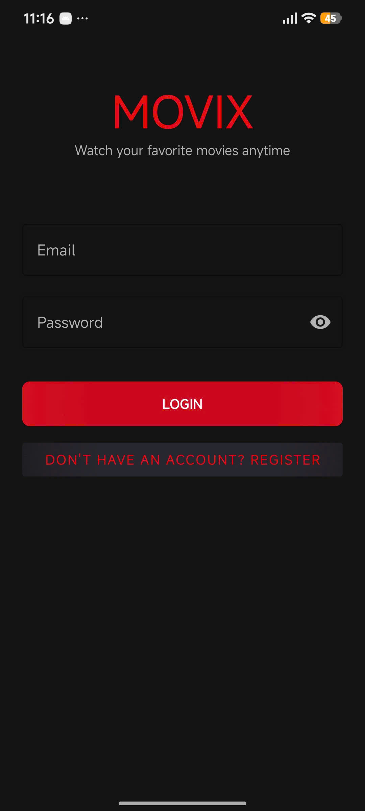
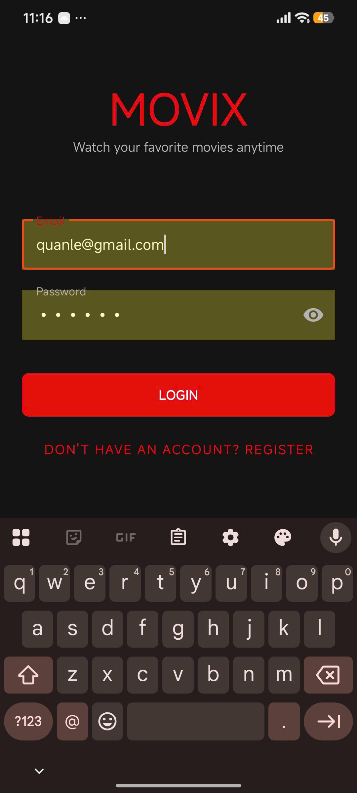
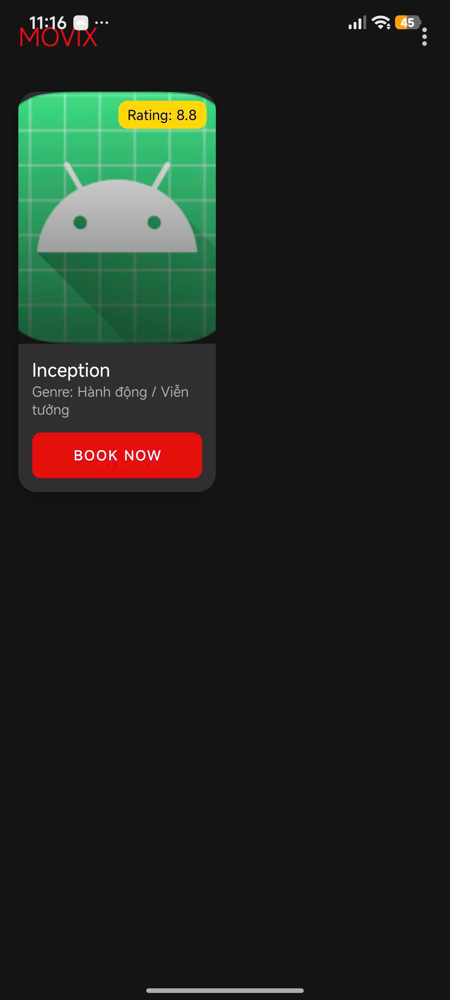
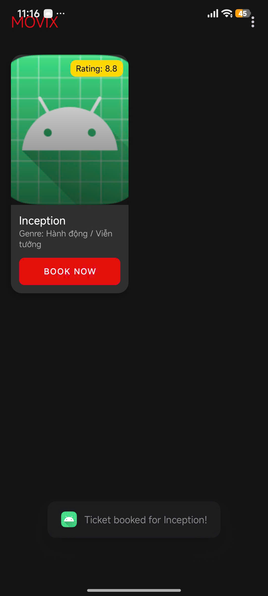
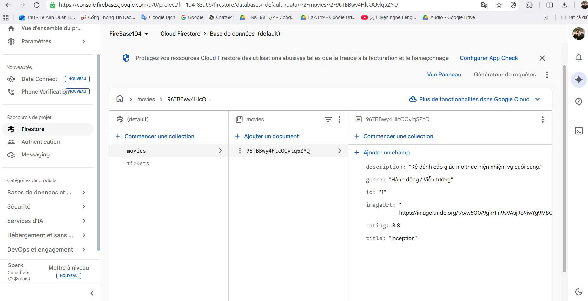
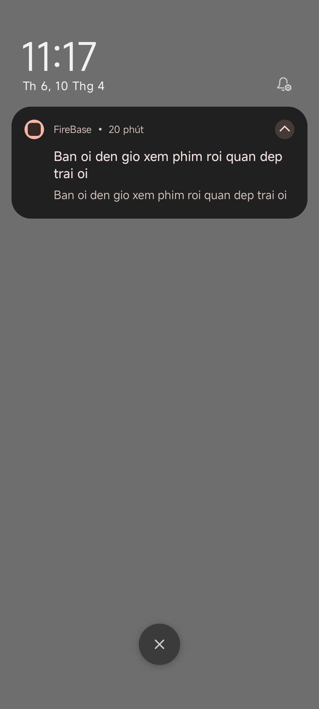
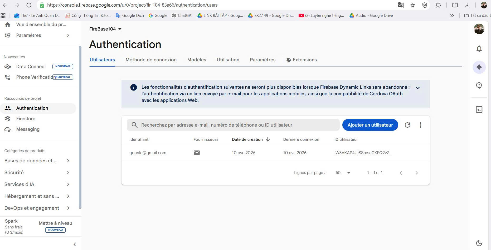
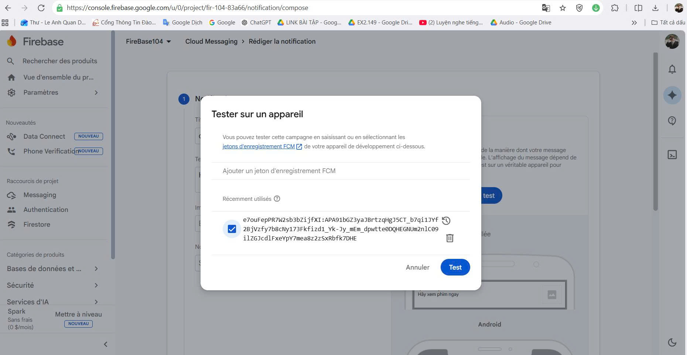
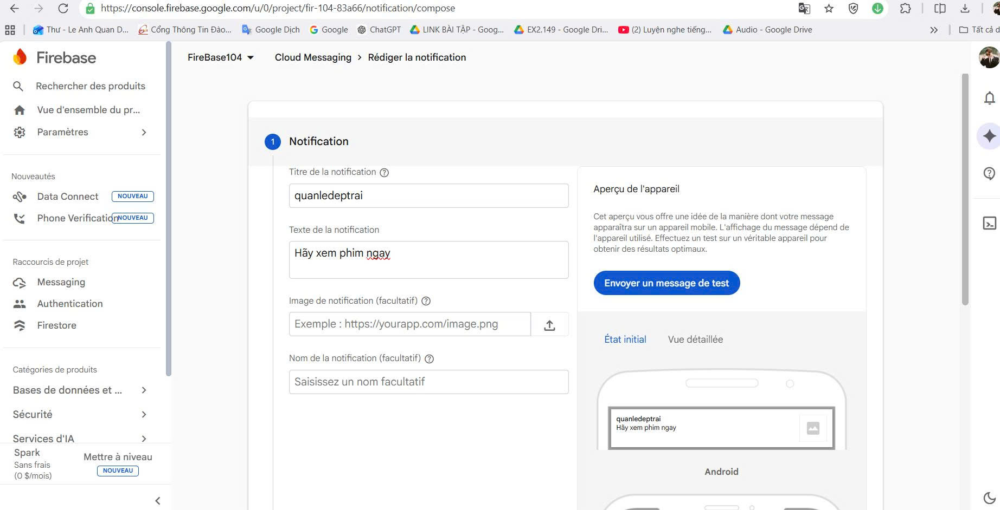
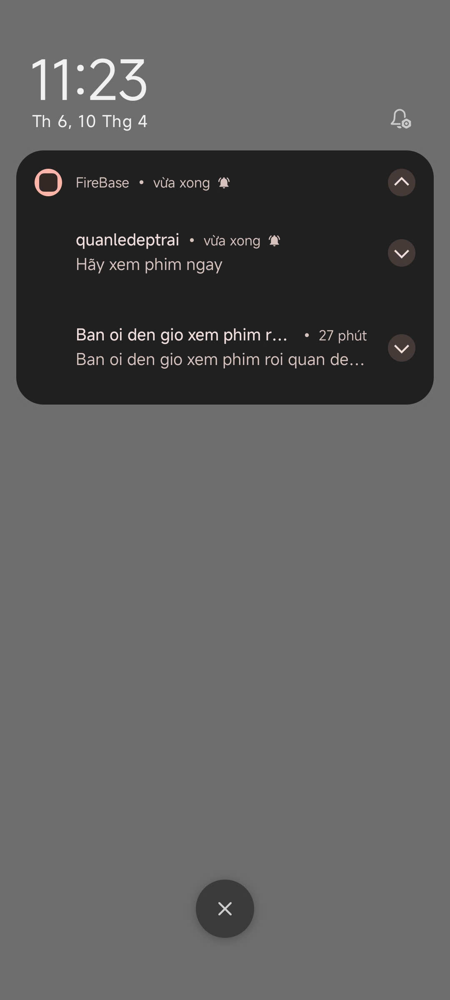

# 🎬 MOVIX - Movie Ticket Booking App

Chào mừng bạn đến với **MOVIX**, ứng dụng đặt vé xem phim hiện đại được xây dựng trên nền tảng Android (Kotlin) và kết nối trực tiếp với hệ sinh thái Firebase.

### 🎞️ Thư viện ảnh bổ sung

  
  
  
  
  
  
  
  

  
  
  
  

## ✨ Tính năng nổi bật

*   **🔐 Xác thực người dùng**: Đăng ký và đăng nhập bảo mật qua Firebase Authentication (Email/Password).
*   **📱 Giao diện Netflix Style**: Thiết kế Dark Theme hiện đại, sang trọng với hiệu ứng Grid Layout 2 cột.
*   **🎬 Danh sách phim Realtime**: Tự động đồng bộ danh sách phim, poster và đánh giá từ Cloud Firestore.
*   **🎫 Đặt vé nhanh chóng**: Lưu thông tin vé đặt trực tiếp vào database với đầy đủ chi tiết (Movie, Seat, Time).
*   **🔔 Thông báo đẩy (FCM)**: Tích hợp Firebase Cloud Messaging để gửi thông báo nhắc nhở lịch chiếu phim.
*   **🖼️ Hiển thị ảnh mượt mà**: Sử dụng thư viện Glide để tối ưu hóa việc tải Poster phim từ URL.

## 🛠 Công nghệ sử dụng

*   **Language**: [Kotlin](https://kotlinlang.org/)
*   **Database**: [Cloud Firestore](https://firebase.google.com/docs/firestore)
*   **Authentication**: [Firebase Auth](https://firebase.google.com/docs/auth)
*   **Cloud Messaging**: [FCM](https://firebase.google.com/docs/cloud-messaging)
*   **UI Components**: Material 3, CardView, ConstraintLayout, RecyclerView (GridLayout).
*   **Library**: Glide (Image Loading), ViewBinding.

## 🚀 Hướng dẫn cài đặt

Để chạy được dự án này, bạn cần thực hiện các bước sau:

1.  **Clone dự án**: Tải code về máy và mở bằng Android Studio.
2.  **Cấu hình Firebase**:
    *   Truy cập [Firebase Console](https://console.firebase.google.com/).
    *   Tải file `google-services.json` và chép vào thư mục `app/`.
3.  **Bật các dịch vụ trên Firebase**: Bật Auth (Email/Pass) và Firestore Database.
4.  **Chạy ứng dụng**: Nhấn nút **Run** (Play) trong Android Studio.

## 📂 Cấu trúc thư mục chính

*   `LoginActivity.kt`: Xử lý đăng ký & đăng nhập.
*   `MainActivity.kt`: Hiển thị danh sách phim và xử lý đặt vé.
*   `MovieAdapter.kt`: Quản lý hiển thị item phim trong danh sách.
*   `MyFirebaseMessagingService.kt`: Xử lý nhận thông báo đẩy từ Firebase.
*   `Models.kt`: Khai báo cấu trúc dữ liệu `Movie` và `Ticket`.

---

